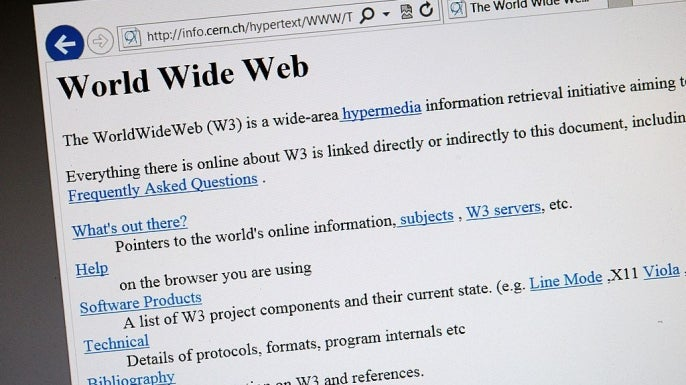
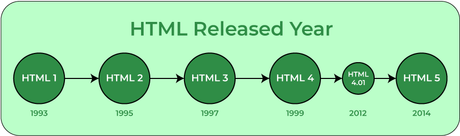

# HTML istorija

HTML (Hypertext Markup Language) yra pagrindinė žymėjimo kalba, kuri naudojama tinklalapių kūrimui. Jos šaknys siekia dar 1989 metus, kai anglų inžinierius ir mokslininkas Tim Berners-Lee, dirbantis Europos branduolinių tyrimų organizacijoje (CERN), sukūrė sistemą, leidžiančią mokslininkams dalintis informacija per internetą. Ši sistema buvo pagrįsta hiperteksto idėja, kuri leido susieti įvairias teksto dalis su nuorodomis į kitus dokumentus.

## Ankstyvieji HTML metai

Pradinėje stadijoje HTML buvo labai paprasta kalba, turinti tik kelis pagrindinius elementus, tokius kaip antraštės (headings), paragrafai (paragraphs), nuorodos (links) ir sąrašai (lists). HTML struktūra buvo skirta ne tik tekstinės informacijos pateikimui, bet ir informacijos susiejimui per nuorodas, leidžiančias vartotojams greitai naršyti tarp skirtingų dokumentų.

Žemiau galime matyti pirmąjį "World Wide Web" puslapį.

## HTML evoliucija

Nuo 1991 m., kai buvo išleista pirmoji vieša HTML versija, ši kalba nuolat vystėsi. 1995 metais buvo pristatyta HTML 2.0, kuri papildė kalbą naujais elementais ir taisyklėmis, padedančiomis geriau valdyti turinio išdėstymą ir stilių. HTML 3.2 (1997 m.) ir HTML 4.0 (1999 m.) įtraukė daugiau multimedijos elementų ir geriau suderino HTML su kitomis technologijomis, tokiomis kaip CSS ir JavaScript.

Žemiau galime matyti HTML evoliuciją.

## HTML5 ir šiuolaikinis internetas

HTML 5, kuris buvo oficialiai patvirtintas 2014 metais, tapo šiuolaikinio interneto pagrindu. Ši versija įtraukė daug naujovių, tokių kaip audio ir video elementai, nauji semantiniai elementai (pvz., "<.header>", "<.footer>", "<.article>"), taip pat geresnę integraciją su CSS3 ir JavaScript. Tai leidžia kūrėjams kurti interaktyvesnius ir patrauklesnius tinklalapius, naudojant mažiau papildomų įrankių ar bibliotekų.

## HTML svarba šiandien

Šiandien HTML yra neatsiejama kiekvieno tinklalapio dalis. Kartu su CSS (Cascading Style Sheets) ir JavaScript, HTML sudaro "internetinių technologijų trejetą", kuris leidžia kurti vizualiai patrauklius ir interaktyvius tinklalapius. HTML yra pagrindas, ant kurio pastatyta visa interneto ekosistema, todėl jo mokymasis yra būtinas kiekvienam, norinčiam tapti sėkmingu interneto kūrėju.